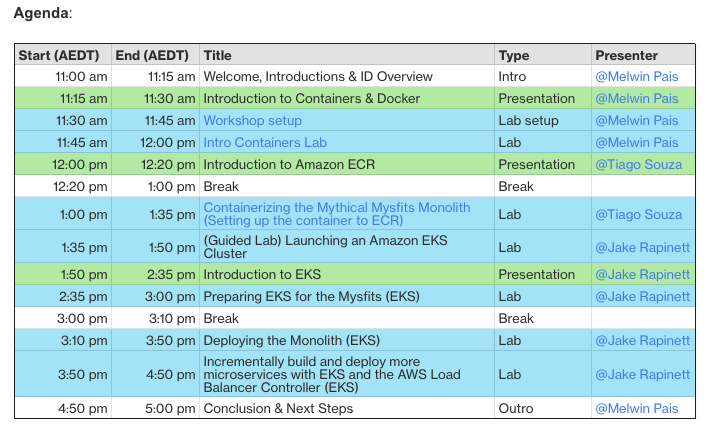

# AWS Containers Immersion Day
This is a helper page for immersion day on November 23rd 2023.

### Agenda
The agenda is as below; time is in AEST and is subject to change depending on the progress.


### Labs
[Containers Immersion Day](https://catalog.workshops.aws/containers/en-US) will be used for the event. 
*Only* the following topics will be covered.

0. **Account set up**: 
    * [Connecting to the AWS Workshop Studio](https://catalog.workshops.aws/containers/en-US/setup/workshop-studio/setup) 
    * [Launching the Cloud9 IDE](https://catalog.workshops.aws/containers/en-US/setup/workshop-studio/launching-cloud9)
    * [Cloning the Immersion Day repositories](https://catalog.us-east-1.prod.workshops.aws/event/dashboard/en-US/workshop/setup/cloneimmersiondayrepo)
    * [Create an SSH key](https://catalog.us-east-1.prod.workshops.aws/event/dashboard/en-US/workshop/setup/createsshkey)
1. **Introduction to Containers**: 
    * [Docker Basics](https://catalog.us-east-1.prod.workshops.aws/event/dashboard/en-US/workshop/contdock/dockerbasics) 
2. **Start from a monolithic application**: 
    * [Lab 1. Containerize the Mythical Mysfits monolith](https://catalog.us-east-1.prod.workshops.aws/event/dashboard/en-US/workshop/mythicalintro/containerize-the-mythical-mysfits-monolith)
3. **Amazon EKS**: 
    * [Lab 5. Launch your Amazon EKS Cluster](https://catalog.us-east-1.prod.workshops.aws/event/dashboard/en-US/workshop/eks/launch-eks) 
    * [Lab 6. Preparing EKS for the Mysfits](https://catalog.us-east-1.prod.workshops.aws/event/dashboard/en-US/workshop/eks/setup-environment)
    * [Lab 7. Deploying the monolith](https://catalog.us-east-1.prod.workshops.aws/event/dashboard/en-US/workshop/eks/deploy-container)
    * [Lab 8. Incrementally build and deploy more microservices with EKS and AWS Load Balancer Controlle](https://catalog.us-east-1.prod.workshops.aws/event/dashboard/en-US/workshop/eks/build-and-deploy)

The participants are free to explore other areas however the support staff will prioritise queries from predefined labs.

### Torubleshooting ###
##### Ignore the Linux 1 expiry alert
Ignore the Linux1 expiry alarm on page [Launching the Cloud9 IDE](https://catalog.workshops.aws/containers/en-US/setup/workshop-studio/launching-cloud9)

##### Upload the public key to your EC2 region
Ignore the below error and follow the subsequent workaround
```
WSParticipantRole:~/environment/amazon-ecs-mythicalmysfits-workshop/workshop-1 (master) $ aws ec2 import-key-pair --key-name "mythicaleks" --public-key-material file://~/.ssh/id_rsa.pub
An error occurred (InvalidParameterValue) when calling the ImportKeyPair operation: Value for parameter PublicKeyMaterial is invalid. Character sets beyond ASCII are not supported.
```
##### EKS 1.24 expiry
[5.3 Launch an Amazon EKS Cluster](https://catalog.us-east-1.prod.workshops.aws/event/dashboard/en-US/workshop/eks/launch-eks/launcheks)
Upgrade to EKS 1.28 in config or on console.


### Housekeeping
  * Use AWS account provided by event host (not your company/personal account)
  * For security reasons, please do not use company/personal datasets
  * You will not incur any costs for the accounts provided for the workshop


